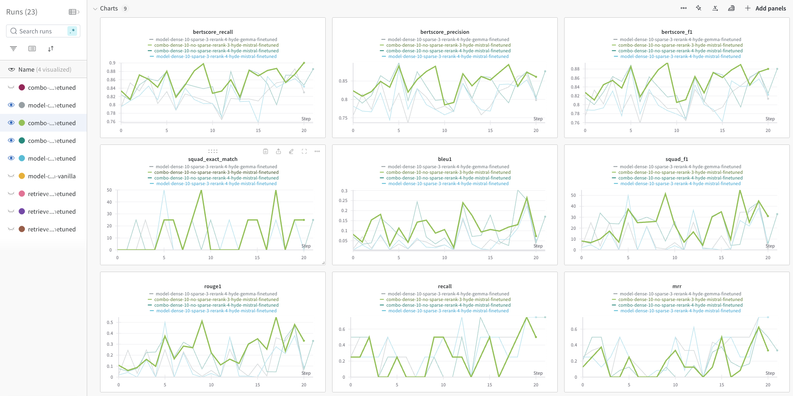
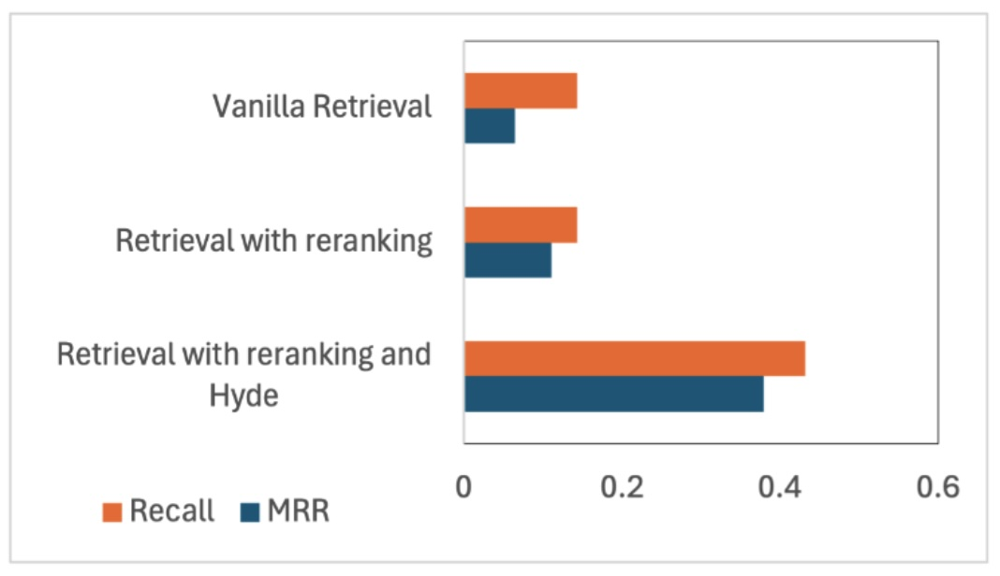
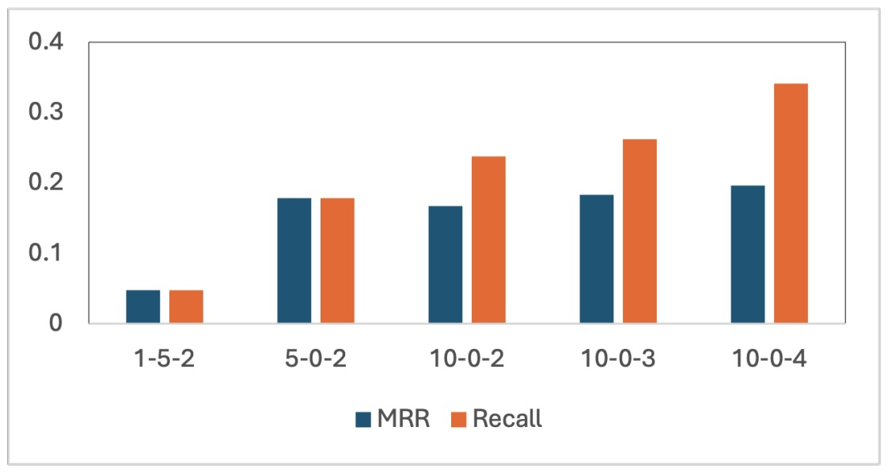
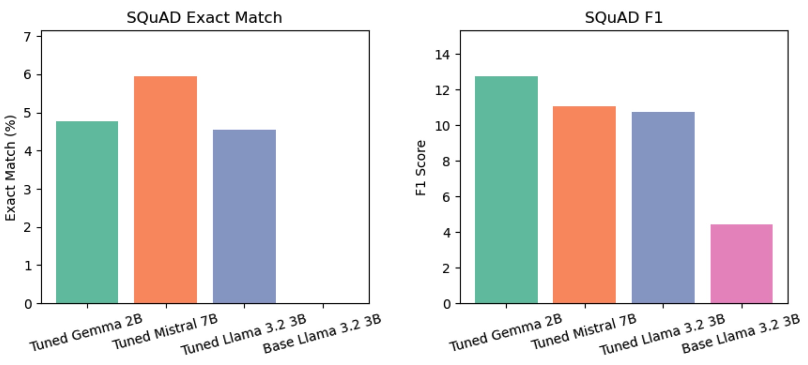

# Answering Questions using Retrieval-Augmented Generation
_Implementation and Analysis of State of the Art Methods_

<div align="center">
    
</div>

This project implements and evaluates an end-to-end retreival-augmented generation pipeline for question answering, using state of the art techniques and evaluating performance. The system specializes is answering questions about Pittsburgh and Carnegie Mellon University.

We use a fine-tuned, quantized version of __Mistral-7B__ as our answering/reader model.

## Try it out

You can try out the final best-performing system on Huggingface Spaces here: [](https://huggingface.co/spaces/jiviteshjn/mistral-rag-qa)  
To understand what's happening behind the scenes, please read the rest of this README before trying it out.

You can ask questions like:  

- _Who is the largest employer in Pittsburgh?_  
- _Where is the Smithsonian affiliated regional history museum in Pittsburgh?_  
- _Who is the president of CMU?_  
- _Where was the polio vaccine developed?_
- and anything else about Pittsburgh and CMU!

A sample list of questions and two sets of outputs generated by the system are provided in `outputs/`.

> [!NOTE]
> Huggingface puts inactive spaces to sleep and they can take a while to cold start. If you find the space sleeping, please press restart and wait for a few minutes.
>
> Further, this is a complex pipeline, consisting of several models, running on a low-tier GPU space. It may take a few minutes for models to load and caches to warm up, especially after a cold start. Please be patient. Subsequent queries will be faster.

## System description

This project implements and analyzes RAG end-to-end, from knowledge corpus collection, model fine-tuning, developing the index, to inference, ablations, and comparisons.  
The following is a brief description of each component:

### Data collection

This project builds its knowledge corpus by scraping websites related to Pittsburgh and Carnegie Mellon University. This includes the official city website, [pittsburghpa.gov](https://www.pittsburghpa.gov), websites about the city's sports teams such as [steelers.com](https://www.steelers.com), websites about the city's events, music, and lifestyle such as [visitpittsburgh.com](https://www.visitpittsburgh.com), websites belonging to Carnegie Mellon University, as well as hundreds of relevant Wikipedia and Encyclopaedia Brittanica pages (obtained by searching for keywords that are related to Pittsburgh according to BERT embeddings).

Scrapy is used as the primary web crawler, owing to its flexibility and controls for not overloading web servers. Beautifulsoup and PDF parsers are also used where necessary, and manual tuning if performed to extract structured data such as calendar events and news items.

See `src/data_collection`.

### Synthetic QA pair generation.

To fine-tune the answering/reader model as well as evaluate our system, we generate synthetic questions and answers from the knowledge corpus using a large language model. We use quantized models for efficiency. A total of __~38,000__ QA pairs are generated.

See `src/data_annotation/qa-generation.ipynb`.


### Manual annotation of test set

To evaluate our system on gold standard examples, ~100 question answer pairs are manually annotated.

See `src/data_annotation/annotate.py` for a simple Annotation UI in Marimo.


### Reader model fine-tuning

We fine-tune the reader model on the generated QA pairs. We use parameter efficient fine-tuning with 4 bit quantization for efficiency, using Quantized LoRA. We compare Mistral 7B, Llama 3.2 3B, and Gemma 2B, and fine Mistral to be the best performing model.

See `src/finetuning`.


### Embedding and dense FAISS index creation

We chunk our documents to a length of 512 tokens and use FAISS as our index store, using a quantized HNSW index for its good performance while saving memory. We use Snowflake's Arctic Embed Medium Long for embedding textual documents, owing to its small size, large context length, and near-SOTA performance on the MTEB leaderboard. We finally embed around 20,000 documents from 14,000 URLs.

See `src/rag_pipeline/embed_and_build_dense_index.py` and `src/rag_pipeline/load_embeddings_and_build_dense_index.py`.


### Sparse entity and date index for augmentation

Our experiments reveal that our retrieval system struggles with entities such as event names and dates, as documents corresponding to two different events tend to be similar as a whole, differing only in small specifics, which translates to embeddings that are similar.

To mitigate this, we experiment with a sparse TF-IDF index built only over extracted entities and dates. We extract dates at index-building and inference time using SpaCy and entities using an off-the-shelf finetuned RoBERTa model. In practice however, we find the sparse index to be noisy (as is to be expected), and its benefits are not enough to offset the added noise and latency to the retriever system. We hypothesize that fine-tuning the embedding model contrastively will be a better solution to this problem.

See `src/rag_pipeline/build_sparse_index.py`.


### Query rewording using Hypothetical Document Embeddings

Query rewriting to make it more similar to the documents that potentially would contain the answer has emerged as a popular technique. We implement this, using an off-the-shelf LLM as the rewriting model. We see significant gains as a result of this modification.

See `src/rag_pipeline/rag_validation.py`.


### Retrieval and reranking

We retrieve documents from the dense and sparse indices separately, and then rerank them using a cross-encoder model (BAAI's BGE-reranker-v2-m3), only keeping the top scoring third of the documents. This approach works remarkably well in maintaining high recall, while also making sure the context is not too large for the reader model to handle (high precision).

See `src/rag_pipeline/rag_validation.py`.


### Retrieved document summarization

Our documents are at most 512 tokens, which makes context lengths long enough to degade performance, even at small k's (k = 3, 4, or 5). To mitigate this, we summarize the retrieved documents using an LLM. The summarization LLM is query-aware.

See `src/rag_pipeline/rag_validation.py`.


### Answer generation using our quantized, finetuned models

Finally, we get to generating answers! The pipeline implemented in `src/rag_pipeline/rag_validation.py` is batched and meant to run evaluations on a test set, and compute metrics. `src/rag_qa.py` implements a simple question answering class that uses the pipeline to anser queries one at a time. `src/app.py` uses this class to create the demo app hosted on Huggingface.


## Usage

To run any component of this RAG system, please first install the required dependencies listed in `src/requirements.txt` using pip.

```shell
$ # preferable inside a virtual environment
$ pip install -r src/requirements.txt
```

> [!WARNING]
> Many quantization frameworks are under active development and support varies across systems and hardwares. This project uses BitsAndBytes, which is not compatible with Apple Silicon at this time. This project has only been tested on Linux servers. The exact requirements may require some tweaking to ensure compatibility with your system (hardware, OS, CUDA versions, etc.)
>
> The Huggingface space is the more convenient way to try this project out.

### Data collection

All data collection scripts, which include crawlers and parsers for various websites are located in the
`src/data_collection` repository.

Scrapy spiders present in the scrapy project `src/data_collection/using_scrapy` can be run using the following command:

```shell
$ cd src/data_collection/using_scrapy
$ scrapy crawl visit_pittsburgh -O path/to/output.jsonl  # or pittsburgh_pa, steelers, pirates, penquins
```

### Data annotation

`src/data_annotation` includes a QA generation notebook (
`qa-generation.ipynb`) for automated data processing and question-answer generation.

To execute the notebook, open it in Jupyter Notebook or a compatible IDE and run the cells in
order.

### Fine-tuning

`src/finetuning_scripts` includes the notebook used to fine-tune the Mistral 7B model on the generated QA pairs using Q-LoRA in 4 bit quantization.

To execute the notebook, open it in Jupyter Notebook or a compatible IDE and run the cells in order.

### RAG pipeline

Components of the RAG pipeline, such as embedding documents and building the dense index, loading existing embeddings
and building the dense index, building the sparse index and infering using the pipeline can be run as Python scripts
from the `src/rag_pipeline` directory. The appropriate configuration needs to be set in a config file present in the `src/rag_pipeline/conf` directory and then specified in the command. Config files are managed using Hydra/OmegaConf
and are in the Hydra format. Please look at existing files for an example. To run the pipeline with a specific
configuration, run:

```shell   
$ python src/rag_pipeline/embed_and_build_index.py --config-name=validation
```

The complete validation pipeline can be run as:

```shell
$ python src/rag_pipeline/rag_validation.py --config-name=validation
```

### Demo app

The demo app can be run as:
    
```shell
streamlit run src/app.py
```

### Data

The processed dataset, including the complete knowledge corpus, generated and manually annotated QA pairs, embeddings, and dense and sparse indices is available on [Kaggle](https://www.kaggle.com/datasets/jiviteshjain/final-rag-data/).

### Fine-tuned Model Weights

Adapters for the best-performing reader model, Mistral 7B fine-tuned using Q-Lora on ~38,000 QA pairs, are available on the [Huggingface Hub](https://huggingface.co/jiviteshjn/pittsburgh-rag-qa-mistral-finetuned).


They can be loaded via Unsloth AI's `FastLanguageModel` or Huggingface's `AutoPeftModel` classes. Please see `
src/rag_pipeline/rag_validation.py` for an example.

### Weights and Biases dashboard with visualizations of our experiments

Along with LangChain for implementation, this project uses Hydra for configuration management and Weights and Biases for experiment tracking.




## Experiments and ablations

### RAG and fine-tuning helps

While numbers tell the same story, the difference is best seen through examples. Note the quality and factuality difference across the Mistral 7B model off-the-shelf, with fine-tuning, and with fine-tuning and retrieved context.

| *Mistral - No Finetune*                                                                                                                                                                                                                                                                                                                                            | *Mistral - Finetuned*                                                                                              | *Mistral - RAG*                                                                                             |
|------------------------------------------------------------------------------------------------------------------------------------------------------------------------------------------------------------------------------------------------------------------------------------------------------------------------------------------------------------------|--------------------------------------------------------------------------------------------------------------------|-------------------------------------------------------------------------------------------------------------|
| *Question:* Where is the NNOC House located? <br> *Answer:* The NNOC House is located in the heart of the city, on a busy street. It is a three-story building with a large front door and a small side entrance. The building is made of brick and has a red roof. The windows are small and the walls are white. The building is surrounded by a small garden. | *Question:* Where is the NNOC House located? <br> *Answer:* The NNOC House is located in Pittsburgh, Pennsylvania. | *Question:* Where is the NNOC House located? <br> *Answer:* 7101 Apple Street at Pittsburgh, PA.            |
| *Question:* What is the theme of Tim Pearce's jokes? <br> *Answer:* The theme of Tim Pearce's jokes is that he is a very funny person.                                                                                                                                                                                                                           | *Question:* What is the theme of Tim Pearce's jokes? <br> *Answer:* His jokes are about his life and experiences.  | *Question:* What is the theme of Tim Pearce's jokes? <br> *Answer:* They are primarily snail-related jokes. |


### Sophisticated retrieval techniques help

<div align="left">
    
</div>

Reranking of retrieved documents using a cross-encoder
model as well as query rewording using HyDE lead to
significant performance gains. All results reported with
k = 5.

### Higher k's lead to better recall; sparse retrieval is noisy

<div align="left">
    
</div>

The x-axis label corresponds to dense k - sparse k - reranking k. The first two sets of bars show that dense retrieval significantly beats sparse entity-based retrieval. Sets 2 and 3 show the benefit of using a larger k for dense retrieval – even if the mean reciprocal rank (MRR) goes down, the overall recall rate improves. Finally, sets 3, 4, and 5 show that the recall rate improves by using larger k’s for reranking, without hurting the MRR.

### Mistral 7B is the best performing model*

<div align="left">
    
</div>

Mistral 7B performs the best on our test set according to the SQuAD exact match metric, which Gemma 2B performs better according to the SQuAD F1 metric, hence the star. The fine-tuned models perform significantly better than off-the-shelf models (which manage to get a 0 on the exact match metric).